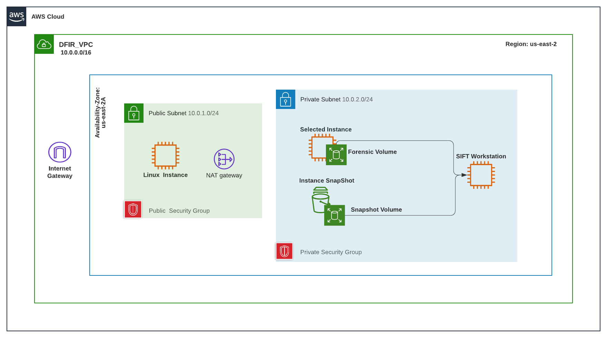
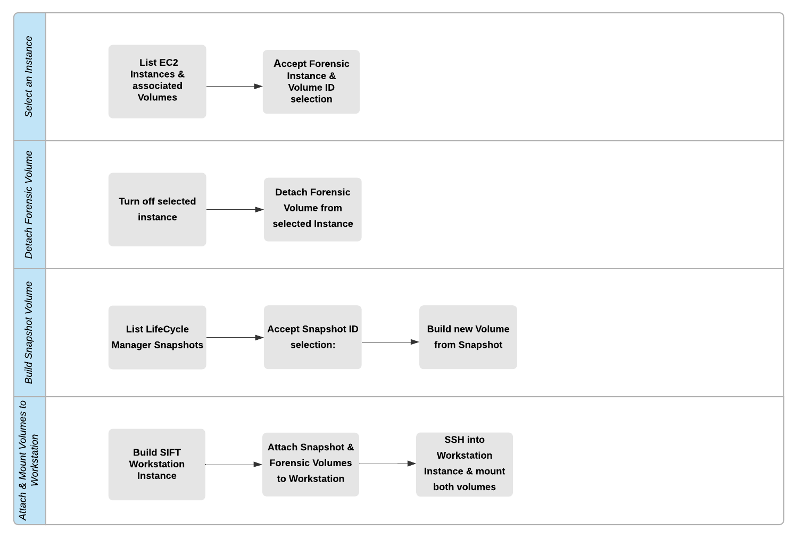

# Linux Volume Mount Automation in AWS
A Python, Boto3 script that shuts down a selected instace, detaches the instance, generates a snapshot volume and attaches both volumes to a worksatation.

---------------------------------------------------------------------------------------------------------------------

### AWS VPC Network Topology:

----------------------------------------------------------------------------------------------------------------------

### Flow of Automation:

----------------------------------------------------------------------------------------------------------------------

### Procedure

#### Step 1:  List EC2 Instances and associated Volumes
This will show the instances running in AWS, with specific values present like tag names to uniquely identify instances. Additionally, Public and Private IP addresses, Subnet ID and AMI ID are listed. Lastly, the function also includes Block Devices or Volumes that are mapped to each instance.

#### Step 2:  Accept Forensic Volume ID & Instance ID selection
For each listed Instance outputted from the previous function, relevant information can be visualized from terminal. The script will prompt for Instance Id and Volume Id input and then save these inputs as variables to be used in the following steps.  

#### Step 3:  Turn off the selected instance
Detaching additional block devices on an instance can be done with a simple function. See Figure 3 for more detail. In order to detach a root ebs backed volume from a selected instance, it must be turned off first. By running a shutdown function before detaching a selected volume, both root and additional ebs volumes can be detached without any risk of losing data. 

#### Step 4:  Detach the Forensic Volume from the selected Instance
After the above shutdown process completes, the selected volume is now able to be detached.  When this volume is detached from its origin instance, the state becomes available for attachment elsewhere. See step 9 for more details.  

#### Step 5:  List the LifeCycle Manager Snapshots
Life Cycle Manager is an AWS resource that accepts policies which generate scheduled snapshots of EBS volumes. When a volume is tagged with a snapshot policy, a snapshot is generated from the associated EBS volume.  By listing instances and then filtering for all instances that contain volumes tagged with a specific snapshot policy, the snapshot ID associated with the selected volume can be identified and inputted.

#### Step 6:  Accept Snapshot ID selection
As stated in Step 5, the list of Life Cycle Manager Snapshots will include a snapshot of the selected  volume if the selected volume has a snapshot policy tag. Included in this listing output will be a snapshot_id, which is inputted in order to make a snapshot selection.   

#### Step 7:  Build new Volume from Snapshot
The selected snapshot identified in step 6 can be used to build a new volume.  This volume becomes the Snapshot Volume. In addition to the Forensic Volume which was detached and made available in Step 4, this Snapshot Volume can also be attached to a new instance. See the remaining steps for more detail.

#### Step 8:  Build SIFT Workstation Instance
Section 1, Part 1 and Part 2, step through the process of building a SIFT AMI. SIFT or SANS Investigative Forensic Toolkit is an Ubuntu Linux distribution packaged with forensic tools. An AMI is an Amazon Machine Image, or the operating system / image to be installed during an Instance build. This Function uses the aforementioned custom SIFT AMI to build a Workstation instance.

#### Step 9: Attach Snapshot Volume and Forensic Volume to SIFT Workstation
With the SIFT Workstation Instance running, and both the Forensic Volume and the Snapshot Volume currently detached and available, the Forensic Volume and the Snapshot Volume can now be attached to the SIFT Workstation Instance.  This is where both the Forensic Volume and Snapshot Volume stay attached. Listing available block devices on the SIFT Workstation Instance will show both new devices.

#### Step 10:  SSH into SIFT Workstation Instance and mount both of the volumes
Automatic SSH tunneling to an Instance allows the function access to the command line of the selected Instance. This function will execute chained bash commands in order to create two new mount point directories and then mount both the Forensic Volume and the Snapshot Volume.    
